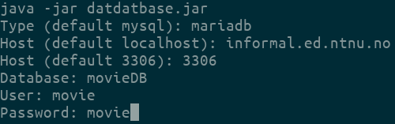
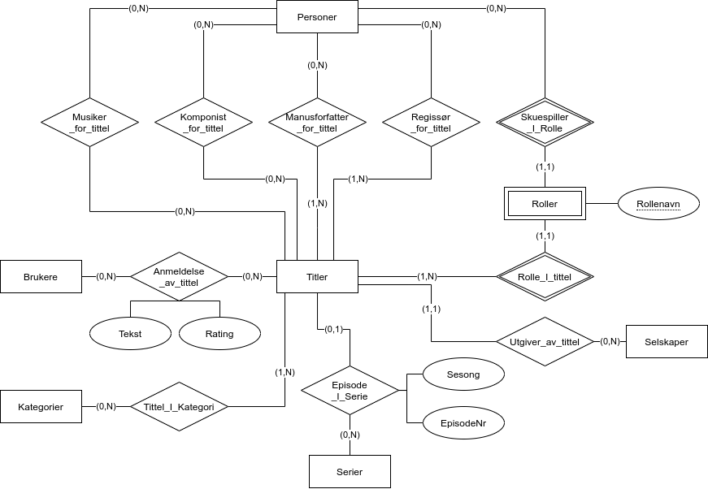
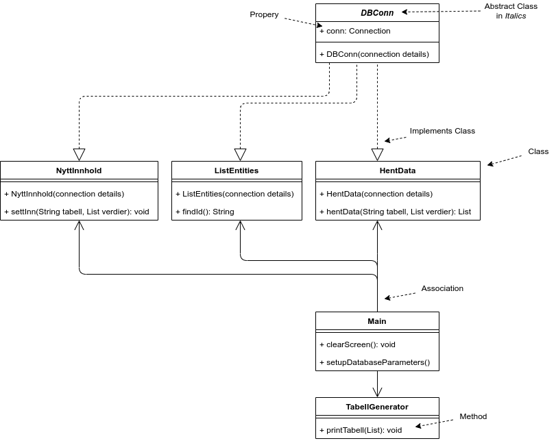
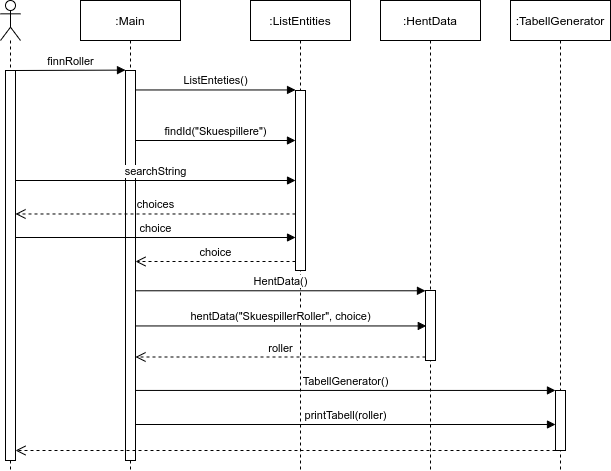
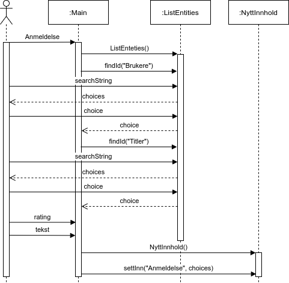

# Internet Movie DatDatBase
Dette er et prosjekt i faget TDT4145 - Datamodellering og Databasesystemer
ved NTNU.
Formålet med dette prosjektet er å implementere en database og et tilhørende
program.
Databasen inneholder informasjon om filmer og serier à la IMDb og programmet
leser og skriver til denne databasen.

En kopi av databasen hostes på informal.ed.ntnu.no.



# Dokumentasjon Database
Databasen er implementert med MySQL.

## Konseptuell Modell
Databasen er basert på følgende ER-diagram:



# Dokumentasjon Program
Programmet er skrevet i java 11 og bruker JDBC for å snakke med databaser.

Use cases som løses av programmet:
1. Finne navnet på alle rollene en gitt skuespiller har.
2. Finne hvilke filmer som en gitt skuespiller opptrer i.
3. Finne hvilke filmselskap som lager flest filmer inne hver sjanger (grøssere, familie, o.l.).
4. Sette inn en ny film med regissør, manusforfattere, skuespillere og det som hører med.
5. Sette inn ny anmeldelse av en episode av en serie.

## Konseptuell Modell
Klassen Main er kontrolleren for programmet.

Programmet er basert på følgende klassediagram:



Et sequence diagram av hvordan programmet finner hvilke roller en skuespiller
har hatt:



Use case 1, 2 og 3 løses på denne måten.

Et sequence diagram som beskriver hvordan programmet setter inn ny data:



Use case 4 og 5 løses på dette viset.

### Notater
Parametere/Variabler med navn `table` referer ikke til en faktisk tabell i
databasen, men en tabell generert av en spørring. Variabelen `table` blir
oversatt til en spørring i en switch-case.

Da vi ikke skal utføre noen utregninger i programmet, lagres og settes alle
variabler/parametere som String. Alt av eventuel utregning overlates til
databasen.

De fleste klassene er basically Singletons.

## Klasser

### Main
Kontroller for programmet.
Henter input fra bruker og kaller på andre klasser for å utføre oppgaver.
Inneholder bare statiske metoder.

#### Properties

```java
public static String type
public static String host
public static String port
public static String database
public static String user
public static String password
public static Properties p
public static HentData hd
public static NyttInnhold ni
public static ListEntities li
public static Scanner sc
```

#### Methods

##### setupDatabaseParameters
```java
public static void setupDatabaseParameters()
```
Henter inn info om databasen man vil bruke fra brukeren.

##### clearScreen
```java
public static void clearScreen()
```
Tømmer konsollet for tekst.

### DBConn
Abstrakt klasse som kan lage en tilkobling til en database.

#### Properties
```java
protected Connection conn
```

#### Methods

##### DBConn
```java
public DBConn(String type, String host, String port, String database, Properties p)
```

**Parameters:**
* `type` - hvilken type database {mysql, mariadb}
* `host` - ip-adresse/url til der databasen hostes
* `port` - hvilken port databasen kjører på
* `database` - navnet på databasen
* `p` - brukernavn og passord

### HentData
Implementerer DBConn.

#### Methods

##### HentData
```java
public HentData(String type, String host, String port, String database, Properties p)
```
Oppretter en tilkobling til databasen.

**Parameters:**
* `type` - hvilken type database {mysql, mariadb}
* `host` - ip-adresse/url til der databasen hostes
* `port` - hvilken port databasen kjører på
* `database` - navnet på databasen
* `p` - brukernavn og passord

##### hentData
```java
public List<List<String>> hentData(String tabell, List<String> verdier) throws SQLException
```
Utfører en spørring basert på forhåndsdefinerte spørringer.

**Parameters:**
* `tabell` - Hvilken tabell/hvilket case man vil bruke.
* `verdier` - Hvilke prammetere man vil sende med spørringen.

**Returns:**
  2-dimensjonal liste med rader fra spørringen.

### NyttInnhold
Implementerer DBConn.

#### Methods

##### NyttInnhold
```java
public NyttInnhold(String type, String host, String port, String database, Properties p)
```
Oppretter en tilkobling til databasen.

**Parameters:**
* `type` - hvilken type database {mysql, mariadb}
* `host` - ip-adresse/url til der databasen hostes
* `port` - hvilken port databasen kjører på
* `database` - navnet på databasen
* `p` - brukernavn og passord

##### settInn
```java
public void settInn(String tabell, List<String> verdier) throws SQLException
```
Utfører en spørring basert på forhåndsdefinerte spørringer.

**Parameters:**
* `tabell` - Hvilken tabell/hvilket case man vil bruke.
* `verdier` - Hvilke prammetere man vil sende med spørringen.

### TabellGenerator
Inneholder en metode for å skrive ut 2-dimensjonale lister som en tabell.

#### Methods

##### public void printTabell(List<List<String>> inputList)
```java
public void printTabell(List<List<String>> inputList)
```
Finner ut hvor stor listen er og hvor bred kolonnene skal være.
Skriver ut tabellen til STDOUT.

**Parameters:**
* inputList: Listen som skal bli tabell. Må være en MxN matrise.

### ListEntities
Implementerer DBConn.
Inneholder en metode for å liste opp verdier fra databasen og lar brukeren velge
en id.

#### Methods

##### ListEntities
```java
public ListEntities(String type, String host, String port,String database, Properties p)
```
Oppretter en tilkobling til databasen.

**Parameters:**
* `type` - hvilken type database {mysql, mariadb}
* `host` - ip-adresse/url til der databasen hostes
* `port` - hvilken port databasen kjører på
* `database` - navnet på databasen
* `p` - brukernavn og passord

##### findId
```java
public int findId(String table)
```
Lister opp innhold i en forhåndsdefinert tabell/spørring og lar brukeren velge en id.

**Parameters:**
* table: Hvilken tabell i databasen man vil se på.

**Returns:**
  id til raden man vil ha
